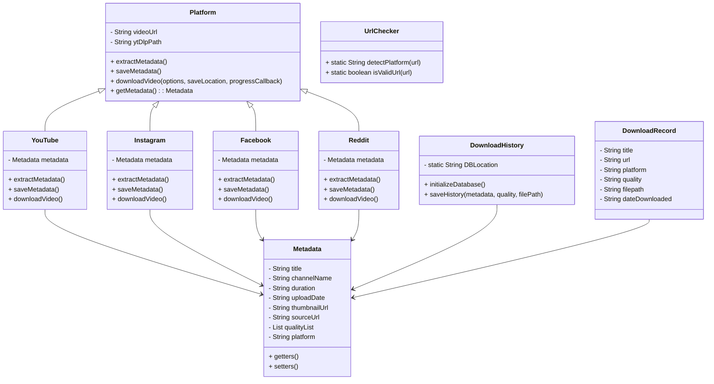
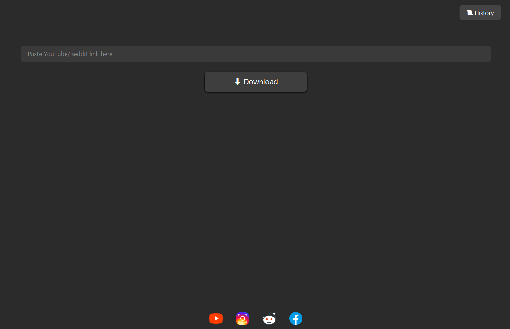
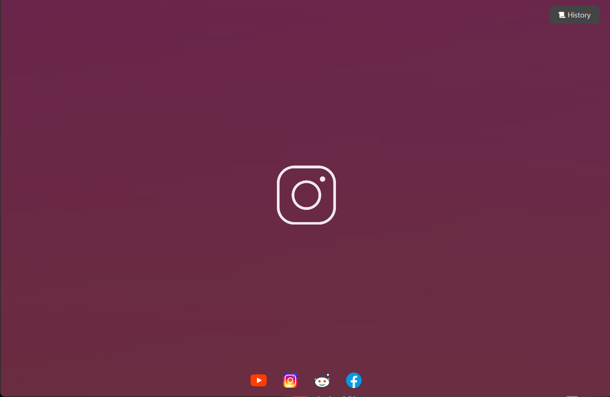
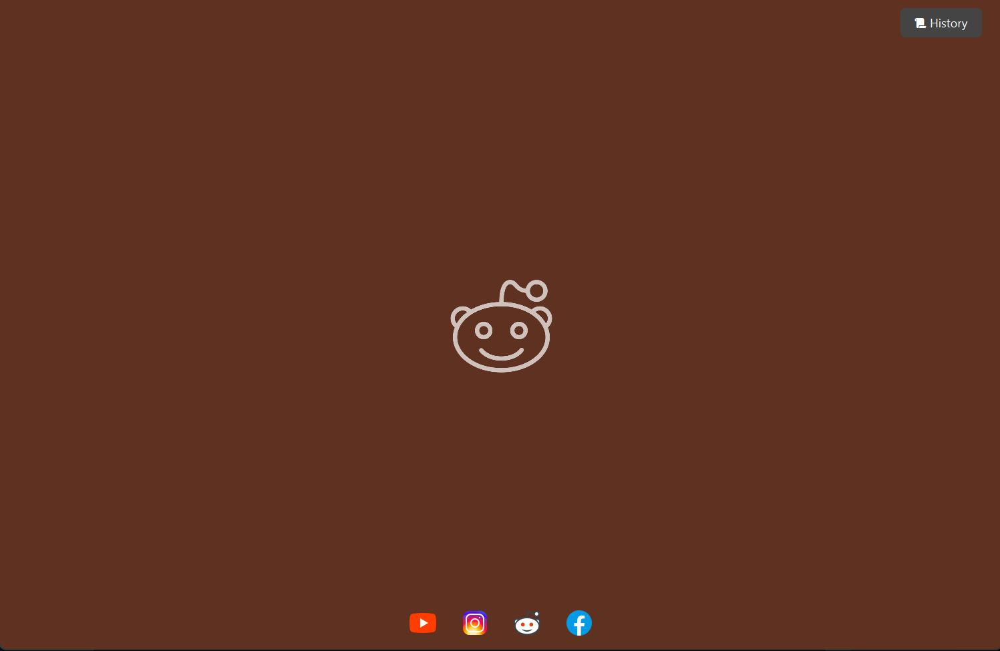
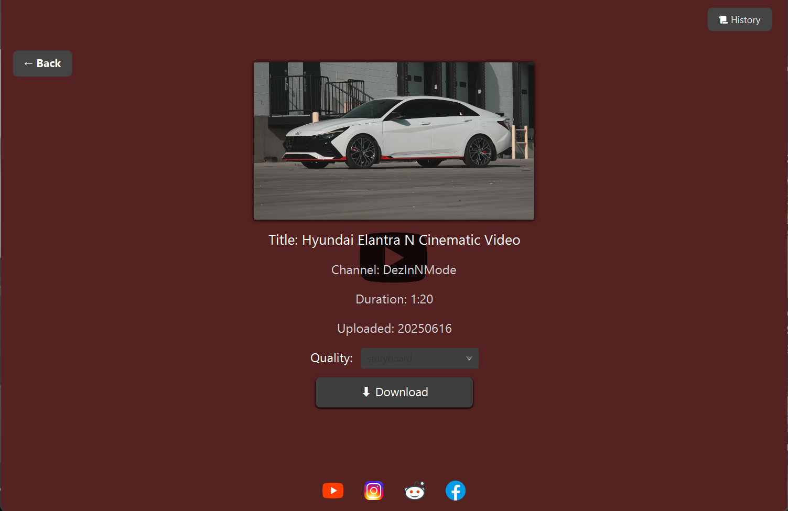
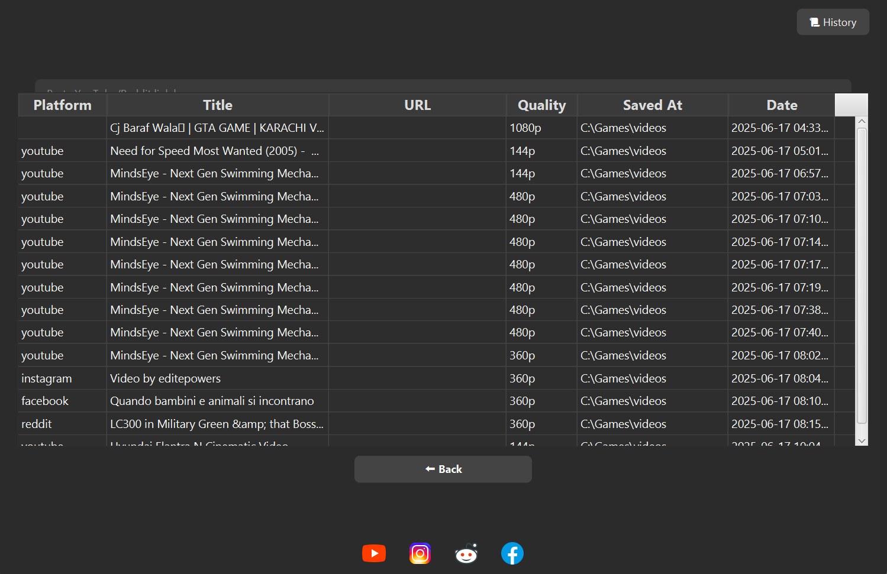
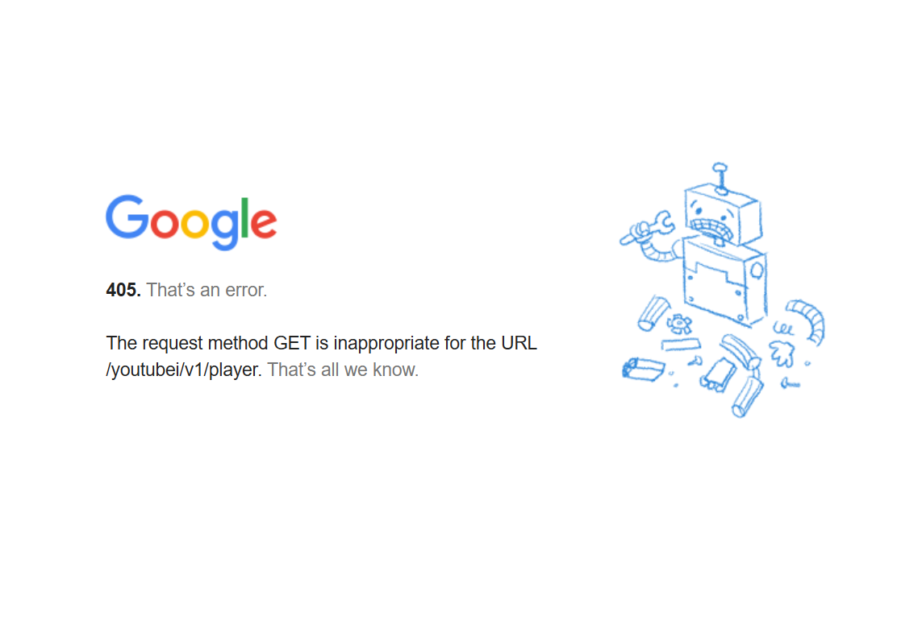

# Internet Video Downloader 🎥

A powerful and user-friendly tool to download videos from various platforms like **YouTube**, **Instagram**, **Reddit**, and **Facebook**, supporting multiple formats and resolutions.

---

## 📌 Table of Contents

- [Introduction](#introduction)
- [Objectives](#objectives)
- [Tools and Technologies Used](#tools-and-technologies-used)
- [System Requirements](#system-requirements)
- [System Design](#system-design)
- [Implementation](#implementation)
  - [Frontend GUI](#frontend-gui)
- [Testing](#testing)
- [Challenges and Limitations](#challenges-and-limitations)
- [Future Work](#future-work)
- [Conclusion](#conclusion)

---

## 📖 Introduction

This application is a user-friendly Java-based desktop program that enables users to download videos from multiple platforms. It supports multiple resolutions and formats, and provides metadata previews and history management.
Just input the URL of your favourite Video and viola!

---

## 🎯 Objectives

- ✅ Download videos from YouTube, Instagram, Reddit, Facebook
- 🎞️ Support multiple formats (MP4, MP3) and resolutions (360p–1080p+)
- 🧠 Extract and display metadata:
  - Title
  - Duration
  - Upload date
  - Creator name
  - Thumbnail
- 🖥️ Clean, intuitive GUI (JavaFX)
- 📶 Real-time download progress tracking

---

## 🧰 Tools and Technologies Used

- 💻 Java (Object-Oriented Programming)
- 🎨 JavaFX for GUI
- 🔽 yt-dlp for downloading media
- 🔄 ffmpeg for media conversion and merging
- 🧱 Core OOP Concepts: Encapsulation, Abstraction, Inheritance, Polymorphism
- 💾 SQLite for Database(For History)

---

## 🖥️ System Requirements

### Minimum:

- **OS**: Windows 7+, macOS 10.12+, Ubuntu 18.04+
- **Processor**: Dual-core CPU (Intel i3 / AMD equivalent)
- **RAM**: 4 GB
- **Storage**: 200 MB + video storage
- **Java Runtime**: Java SE 8 or later
- **Internet**: Required

### Testing Environment:

- Windows 11 (22H2), Intel i7 11th Gen, 16GB DDR5, RTX3060 6GB, 2560×1440 Display

---

## 🧩 System Design

### Class Diagram

---

## 🚧 Implementation

### 🎨 Frontend GUI (JavaFX)

The app features separate interfaces for each platform and additional utilities:

#### Main Interface

#### 📺 YouTube GUI

#### 📷 Instagram GUI

#### 🧵 Reddit GUI

#### 📘 Facebook GUI

#### 🧠 Metadata Preview

#### Quality Selection

#### 📜 Download History View

---

## 🧪 Testing

- Tested individual backend classes via unit method calls
- Verified GUI interactions and download flow
- Verified cross-platform compatibility and download success from each platform

---

## ⚠️ Challenges and Limitations

### ❌ Direct Video URL Parsing
- Initial idea was to retreive video link via HTML
- Video links split into many parts
- YouTube encrypts stream URLs (signature ciphering)
  
  links look like: https://www.youtube.com/youtubei/v1/player?key=AIzaSy.
  
  signature cipher look like: "s=Aoq0s...&sp=signature&url=https:%3"
- Needed real-time JavaScript decryption (impractical)

### 🎵 Split Video/Audio Streams
- High-res videos use separate audio and video streams (DASH)
- Required merging using `ffmpeg`

### 🔒 Google API and Apex Restrictions
- Internal APIs returned 403/405 errors
  
- API key couldn’t bypass Apex server limitations

### 🔁 Pivot to yt-dlp
- Switched to `yt-dlp` for stability and broader platform support
- Integrated via `ProcessBuilder` and parsed download progress in real-time

---

## 📈 Future Work

- Launch a web-based version of the downloader
- Add SEO-optimized landing pages for discoverability

---

## ✅ Conclusion

Despite technical limitations with platform protections and obfuscation, we successfully implemented a robust, cross-platform downloader using open-source tools like `yt-dlp` and `ffmpeg`. The modular OOP design allows easy future expansion.

---
